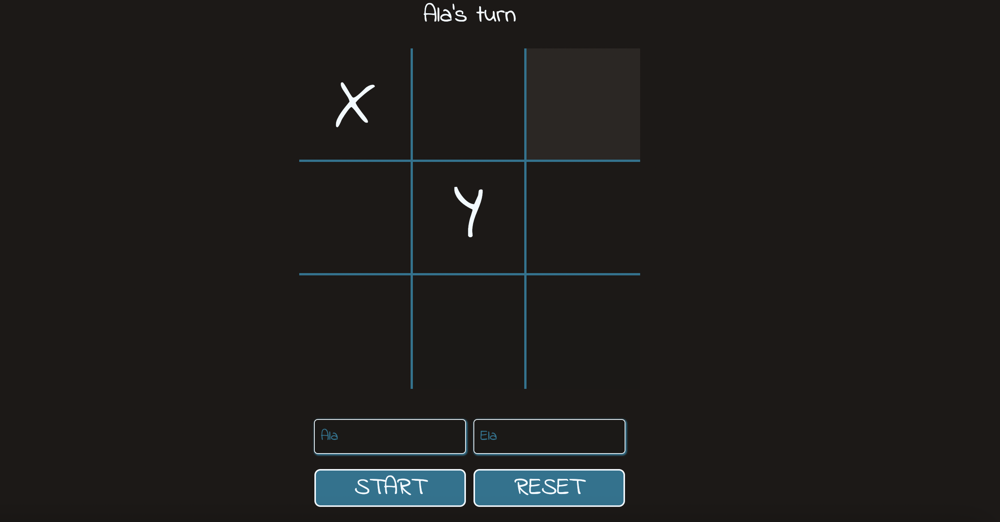

# My Second Game:  Tic Tac Toe

## Table of Contents
* [General Info](#general-information)
* [Technologies](#technologies)
* [Screenshots](#screenshots)
* [Link to game](#link-to-game)
* [Setup](#setup)
* [Usage](#usage)

## General information
It's my second game using JavaScript. Game is one of the task from [The Odin Project](https://www.theodinproject.com/lessons/node-path-javascript-tic-tac-toe/project_submissions?page=2) .

The main task was practicing module pattern in JS with IIFE functions and also factory functions.

## Technologies
* CSS3
* HTML5
* JavaScript

## Screenshots

## Link to game
https://agata10.github.io/TicTacToe/

## Setup

1. Fork repository 
or
2. Clone reposiory
   `git clone https://github.com/YOUR-USERNAME/YOUR-REPOSITORY`

## Usage

The game is traditional tic tac toe for two players that can enter their names. 

Althogh, game seems simple, it was challenging for me!
I'm glad I got working everything as I wanted. Did learn lots of it.